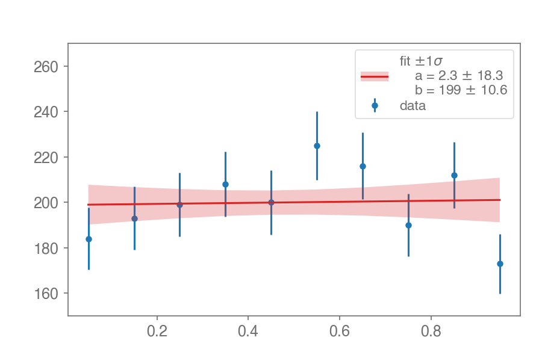

## tidfit


[](https://pypi.python.org/pypi/tidfit/)


```bash
pip install tidfit
```

### Overview

This package provides a tiny routine to fit a curve to pairs of points and draw it
with some error bands. Only depends on `numpy`, `scipy`, and `matplotlib`. It's essentially
a wrapper around `scipy.optimize.curve_fit`.

```python
import numpy as np
import matplotlib.pyplot as plt

x = np.array([0.05, 0.15, 0.25, 0.35, 0.45, 0.55, 0.65, 0.75, 0.85, 0.95])
y = np.array([184., 193., 199., 208., 200., 225., 216., 190., 212., 173.])

fig, ax = plt.subplots()
ax.errorbar(x, y, yerr=y**0.5, fmt="o", label="data")
```

To specify the function to fit, one can use an `eval`-able string expression,
which needs one `x` to serve as the independent variable. 
The remaining variables are considered as fittable function parameters.
Of course, `fit` takes a regular callable function (`lambda x,a,b: a*x+b`) as well, but who has the time to type out 10 more characters?

```python
from tidfit import fit
fit("a*x+b", x, y)
```


A boolean `mask` specifies which points to consider in each fit.

```python
bins = np.linspace(-5, 5, 41)
y  = np.histogram(np.random.normal(-2, 1, 500), bins=bins)[0]
y += np.histogram(np.random.normal(+2, 1, 500), bins=bins)[0]
x = bins[:-1] + 0.25

fig, ax = plt.subplots()
ax.errorbar(x, y, yerr=y**0.5, fmt="o", ms=5)

gaussian = "const + peak * np.exp(-((x - mu) ** 2) / (2 * sigma ** 2))"

fit(gaussian, x, y, sigma=y**0.5, mask=(x < -1), color="C1")
fit(gaussian, x, y, sigma=y**0.5, mask=(x > +1), color="C2")
```


An array of initial parameter values, `p0`, is also accepted as a keyword argument to `fit` and passed through to `curve_fit`,
but keeping track of an array while modifying the fitting function is cumbersome.
If an explicit function is specified, any default arguments are extracted and used as the initial `p0` to `curve_fit`.
```python
def f(x, const=None, peak=None, mu1=+2, sigma1=1, mu2=-2, sigma2=1):
    return (
        const
        + peak * np.exp(-((x - mu1) ** 2) / (2 * sigma1 ** 2))
        + peak * np.exp(-((x - mu2) ** 2) / (2 * sigma2 ** 2))
    )

fit(f, x, y, sigma=y**0.5)
```


The object returned by `fit` has a nice representation in notebooks
```python
out = fit("a+b*x", [0,1,2], [1,3,3], draw=False)
out
```
parameter | value
-- | --
a | 1.333 ± 0.7454
b | 1 ± 0.5774

but `out` is just a `dict`, and provides two ways of getting the parameter names, values, and errors:
``` python
print(out)
```

```python
{'func': <function fit.<locals>.<lambda> at 0x12e049f28>,
 'params': {'a': {'error': 0.75, 'value': 1.3333},
            'b': {'error': 0.5774, 'value': 1.0}},
 'parerrors': array([0.745, 0.577]),
 'parnames': ('a', 'b'),
 'parvalues': array([1.333, 1.   ])}
```

And for convenience, `out` contains the fitted function ready to be called with an array of x-values
```python
func = out["func"]

residuals = ydata - func(xdata)
```

